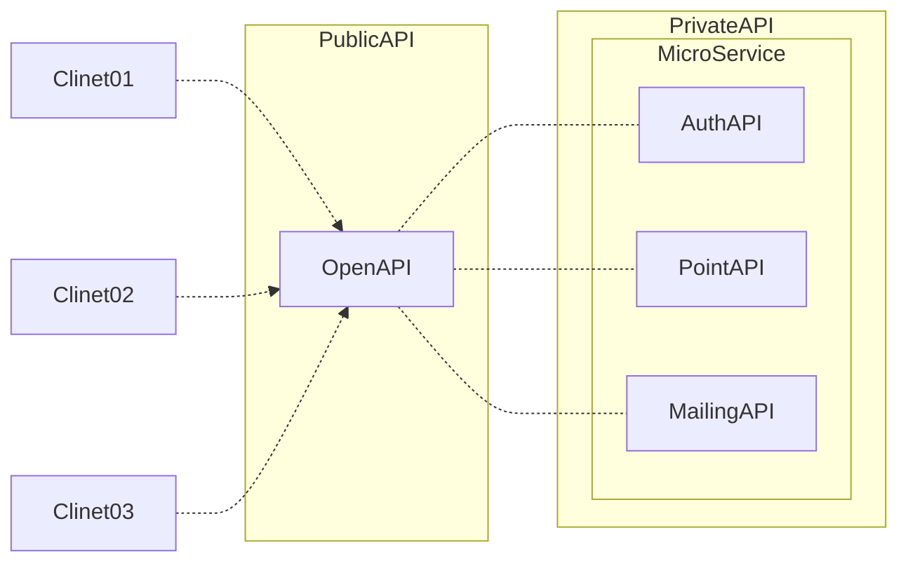

## 처음 시작하는 마이크로서비스



> 매우 추상적이며, 구체적 예제 보다는 개념 및 기본원칙에 대한 설명이 많다.
> 자신이 원하는 서비스를 어느정도 혼자서 직접 모든것을 만들줄 알지만 좀 더 명확하고 검증된 방식이 없을까 고민하시는 분들께 추천한다.
> 중반 이후 부터 시작하는 대략적인 도구[깃,도커, AWS 등] 사용 설명 부분이 짧고 간결하게 설명 되어있다.
> 다만 이부분 부터 책에서 추구하는 목적을 이해하려면 (또는 예제를 따라 가려면) 어느정도 이 도구들의 사용에 익숙해져 있어야 어려움 없이 읽을 수 있을 것 같다.
>

## 1장. 마이크로서비스 아키텍처로의 여정

### 마이크로 서비스의 장단점

- 장점
    - 각각의 마이크로 서비스의 조정을 최소화를 강조
    - 각각의 마이크로 서비스의 독립된 소규모 작업 수행 설계
    - 각각의 마이크로 서비스의 재활용을 통한 빠른 개발
- 단점
    - 각각의 마이크로 서비스의 조직화에 대한 예측의 어려움
        - 각각의 독립적인 서비스가 한개로 굴러 가기 시작하였을때 파악이 되므로, 이때는 되돌려서 수정하기 어려울수도 있다. (Mediator 프로젝트 할때 경험함)
        - 피드백의 지연은 에러 및 업무 최적화에 난이도를 상승 시킨다.
    - 각각의 독립성을 보장하는 대신, 통일된 프로세스를 포기하므로 복잡한 시스템 구조를 가지게 된다.
        - 복잡한 서비스 → 단순 유지보수의 어려움, 많은 지식을 요하게 된다.
    - 정해져 있는 큰 틀의 룰이 없다. 무한한 자율성과 확장성을 보장하지만, 예측가능한 에러의 제어나, 최적화 및 서비스의 목표달성 부재에 대한 위험성이 있다.

### 학습에 있어서 중요한 목표

- 정답은 없다. 단, 작은 프로젝트부터 시작하여 다양한 실패를 극복해가면서 역량을 키우는것이 중요하다.
- ADR(설계 결정 문서) 의 구성
    - 주제 : 목표 및 해결해야 하는 문제, 의도의 명확한 결정
    - 대안 : 주제를 달성하기 위한 솔루션에 대한 대안이 선택한 방법에 대한 뚜렷한 근거가 된다.
    - 선택 : 선택한 결정 기록
    - 영향 : 선택한 결정에 대한 영향 (장단점 등)에 대한 예측 및 또 다른 선택에 대한 근거가 된다.

### 용어 설명

- ADR : Architectural decision record - 설계 결정 문서
- LARD : Lightweight architectural decision record - 경량 설계 결정 기록
- IaC: Infrastructure as code - 인프라의 코드화

---

## 2장. 마이크로서비스 운영 모델 설계

### 팀 설계 중요

- 좋은 기술을 습득한 독립적이고 우수한 팀
- 팀별로 규격화된 프로세스의 적용으로 빠른 개발(작고 독립적인) 및 유연성 확장
- 팀간의 유연하고 **빠른 의사소통**과 결정, 그에 대한 **문서화**가 제일 중요하다.
- 팀 규모는 작을수록 좋다. 최대 8명.
- 업무(마이크로 서비스)는 팀 내에서 자연스럽게 토론되고 해결 될 때 바람직 하다.
- 팀에 가치를 부여하는 사람을으로 구성한다. = 프로젝트에 기여하는 사람으로만 구성한다. 관리자 및 의사 결정에 관련이 없는 사람은 필요하지 않다.
- 각각의 마이크로 서비스가 너무 독립적이거나, 다른 서비스와 동떨어진다면 프로젝트의 목표 달성에 어려움이 생길수 있다. 지속적인 팀간의 의사 소통 및 업무에 대한 공유, 문서의 공유가 필요하다.
- 각각의 마이크로 서비스의 장애는, 각팀에서 관리 및 제어되며 다른 팀에 영향을 끼치면 안된다.

### 팀 토폴로지 (Team topology) 확립

- 문서의 통일화
- 인원 및 팀에 대한 확실한 업무 분할 및 지속적인 업데이트
- 팀 유형의 정리 (p. 40 참조)

### 용어설명

- 운영 모델 : 팀을 구성하는 모든 개념 주체 및 운영 방법
- Topology : 체계적인 분류, 위상 배치 - 토폴로지

---

## 3장. 마이크로 서비스 설계: SEED(S) 프로세스

- 서비스의 품질 향상을 위하여 **반복 가능한 표준 프로세스**를 사용한다.

### SEED

1. Actor(사용자) 식별
    1. API → 상품 → 고품질 상품 → 서비스 받는 고객 이해 (페르소나)
    2. 페르소나의 이해 → 서비스의 범위화 우선순위 제공
2. Actor가 수행하는 작업 식별
    1. 모든 요구조건은 정확 하기보다, **구체적(개발 친화적)** 이어야 한다.
    2. 개별 엑터가 5개 이상이면 대부분 우선순위가 사라졌거나 서비스 경계가 너무 넓은 것이다.
    3. 문제를 해결하기 위해서 사용한것(사용자 입장)을 최우선 목표로 정하면 우선순위 정하기가 쉬워진다.
3. Jobs to be done 와 상호작용 패턴을 기반으로 높은 수준의 작업 및 쿼리 도출
    1. ~ 일때 (상황), 사용자는 ~ 하기를 원하고(동기), 사용자는 ~ 를 할 수 있다. (목표)
4. 구현해야 할 구체적 목표를 정리하여 시퀀스 다이어그램을 사용하여 상호작용 패턴 발견
    1. 업무 패턴을 구체화 하여 시퀀스 다이어 그램(시각화)으로 표현한다.
5. 개방형 표준 (gRPC or GraphQL 등) 을 사용하여 각 액션 및 쿼리를 스펙으로 설명
    1. 규격화된 API문서 도출 (gRPC, RESTful, GraphQL 등)
6. API 사양에 대한 피드백
    1. 규격화된 API 를 통한 팀 간 회의
7. 마이크로 서비스 구현
    1. API 문서를 통한 실제 서비스 구현

### API - MicroService

- API 는 외부 공개용 - MicroService 는 외부로 공개되지 않는다.
- MicroService 끼리 통신하는것은 의존성을 만든다. → 서로 통신하지 않는다.
    - 반드시 필요한 작업일 경우, 메세지큐를 이용한, 구독방식(Publish-Subscribe) 방식으로 최소한의 결합만 유지한다. → 공급자가 데이터를 바꿀수 있으므로, 이 부분에서도 서로 충돌날 가능성을
      예상해야 한다.
- OpenAPI (Public) 가 모든 MicroService(Private) 들을 관리한다. (오케스트레이션)



---

## 4장. 마이크로서비스의 크기 조정: 서비스 경계

- 서비스 분리
    1. 기술적 요구 (함수단위 등)으로 분리하는 것은 바람직하지 않다.
    2. 모듈식(의미단위) 캡슐화가 바람직하다.
    3. 서비스 초기 너무 많은 마이크로 서비스를 생성하는것은 권하지 않는다.
- 도메인 주도 설계와 마이크로서비스 경계
    - 느슨한 결합
    - 높은 응집력
    - 높은 가용성 (비지니스 로직 친화적)
    - 각각의 서비스에서의 공통 어휘의 변화를 보면 서비스의 경계를 확인하기 쉽다.
        - 예 : 같은 단어이지만, 다른 의미로 쓰이는 단어로 서비스를 구분한다.
            1. AuthAPI - Account : 고객
            2. PointAPI - Account : 계좌
- 이벤트 스토밍 (p.93 참조)

---

## 5장. 데이터 처리

- 독립적인 배포와 데이터 공유
    - 마이크로 서비스는 느슨하게 결합되어 있으며 독립적으로 배포할수 있어야 한다.
    - 마이크로서비스 내부의 기능과 관련하여 높은 응집력을 가져야 한다.
    - **데이터 공유(DB share)는 금지 - 동일한 테이블을 조작하지 않는다면 허용.**
- 데이터 관리 1 (전통적 관계형 데이터 베이스 모델링)
    1. 단순 참조 데이터 : 데이터 중복(복사)을 통한 독립 서비스 구축 → 읽기전용으로 작성하며 큐를 사용하여 분배한다.
    2. 분산 트랜젝션과 실패 처리
        - ACID 패턴 : 마이크로서비스에서 ACID 트랜젝션의 거의 불가능이거나 비용이 많이드는 방식이다.
        - Saga 패턴 : 실행 - 실행취소 를 여러개(순서처리) 연결하여 데이터 처리. 실패한 지점에서 하나씩 롤백. 단, ACID 와 같이 정확한 데이터처리는 아니나 합리적인 (실패는 있으나 없는것과
          비슷한) 형태여야 한다.

          이벤트의 순서가 전체 프로세스에 영향을 크게 미치게 된다. 일반적으로 취소하기 어려운 단계를 트랜젝션의 마지막 단계로 이동하는것이 좋다.

          취소의 실행에 문제가 생기면 모든 작업이 롤백되지 않는 위험성을 가지고 있다.

          두개 이상의 API가 트랜젝션으로 묶여야 하는경우 그 중간에 중간자(인터페이스 API 등)를 두어 트렌젝션의 정확성을 만들수 있다.

        - 여러개의 실행, 실행취소 방식의 트렌젝션 모형

        ```mermaid
        flowchart LR
        
        subgraph ReservationAPI 
        	direction TB
        	Reserve -.- CancelReserve
        end
        
        subgraph AlertAPI
        	direction TB
        	SendMsg -.- SendRollbackMsg
        end
        
        subgraph WalletAPI
        	direction TB
        	Exec -.- Cancel
        end
        
        Exec --> |실행| SendMsg --> |실행| Reserve
        CancelReserve --> |취소| SendRollbackMsg --> |취소| Cancel
        
        ```

        - 두개의 API가 트렌젝션으로 묶여야 하는 경우

        ```mermaid
        flowchart LR
        
        PointAPI
        MailingAPI
        OpenAPI[/OpenAPI/]
        
        subgraph Private
        	PointAPI -.- WalletIF
        	MailingAPI -.- WalletIF
        end
        
        subgraph Public 
         OpenAPI -.- WalletIF
        end
        
        ```

1. 데이터 관리 2
    1. 이벤트 데이터 저장 방식
        1. 거래앤진에서 ChangePoint 와 같은 데이터의 집합을 저장한다.
            - 모든 이벤트를 저장한다면, 처음에서부터 지금까지의 모든 행동을 재현할수 있다.
        2. 중간중간 스넵샷을 찍어서 계산을 복기 시간을 단축 시킨다.
        3. 이벤트 저장소의 기본 인터페이스

            ```tsx
            interface IF {
            	save();
            	getNAfterX();
            }
            ```

---

## 6장. 인프라 파이프라인 구축

- DevOps
    - 데브옵스의 원칙과 관행
        - 변경 불가능한 인프라
            - 불변형 → 업데이트의 유일한 방법은 새로 구축
            - 규격화로 인한 장점 → 빠른 복제
            - 다양한 시도를 위해서는 다양한 시도를 해볼수 있는 클라우드 플렛폼이 최적이다 → 물리적 방법은 하드웨어 구입등 기회비용이 많이 나오게 된다.
        - IaC (Infrastructural as Code)
        - CI/CD

- 용어정리
    - CI - Continuous Integration
    - CD - Continuous Delivery

---

## 7장 ~ 끝 : 실전 예제

- 필요할 때 다시 읽어보기
