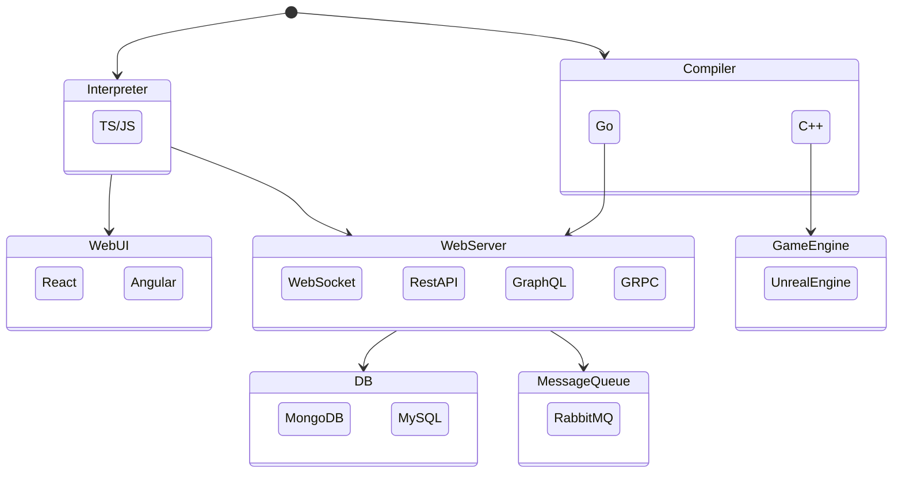
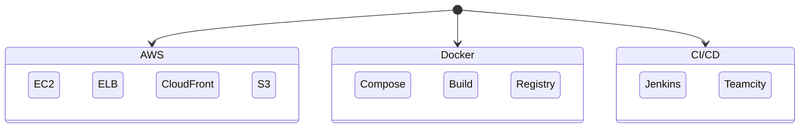
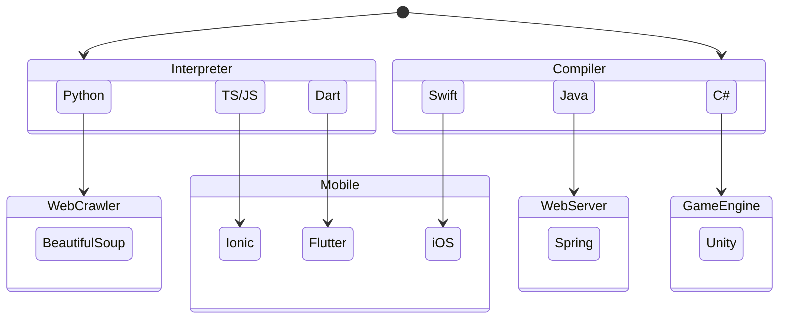

## Interesting

+ Unreal Engine VS Unity
    - 익숙함의 (C#), 무한 가능성의 (C++)
    - 아직도 명료하게 정의 내리지 못하고, 양쪽 다 기웃거리며 공부하고 있다.
    - 저수준 언어의 필요성 때문에 러닝커브가 높은 언리얼 엔진 쪽에 마음이 기울고 있다.

+ SAM (AWS Serverless architecture)
    - 회사 프로젝트에 적극 도입이 필요할 듯 하여 자발적으로 공부하고 있다.
    - 개발에 익숙하다면 서버운영 비용을 획기적으로 줄이고, 유연성도 확장하는 아주 좋은 기회가 될 것이다.

---



## [GoSQL](/projects/gosql.html)

* Go 에서 쓰던 여러 ORM-like 라이브러리들이 편의성과 사용성에 많은 아쉬움에 작성하게 되었다.
* DB의 많은 기능들이 있겠지만, 필자가 주로 쓰는 기능부터 개발하려고 한다.
* 개발중 ...

---

## Memories

+ 게임(GBA 또는 NDS) 한글화 작업
    - 롬파일을 HEX 에디터로 열어 이미지 및 스크립트 검색
    - 압축된 파일 추출 및 해제
    - 폰트 치환 및 번역
    - C 언어로 스크립트 번역기 개발 및 분해된 롬파일 결합 프로그램 작성

---

## Primary skills

---

## DevOps

  
---

## Secondary or experiences

---

* [Licenses](/licenses.html)
